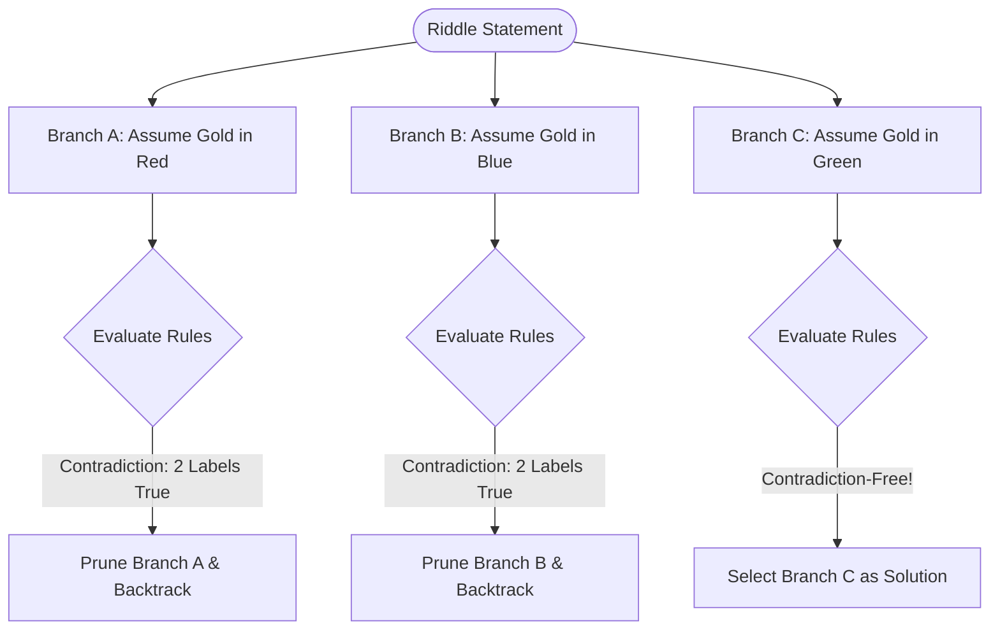
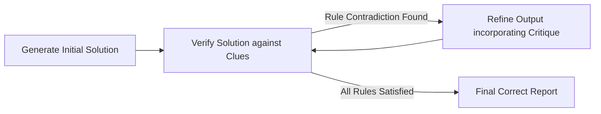

# Reasoning Techniques Pattern

This folder implements the **Reasoning Techniques Pattern** (inspired by Chapter 17 of *Agentic Design Patterns*). In agentic AI, complex planning or logical deduction often fails when relying on a single, direct LLM generation. By structuring the agent's internal cognitive process using explicit reasoning pathways, agents can solve logical, mathematical, and sequential planning problems with much higher accuracy.

This pattern demonstrates three key reasoning strategies:
1. **Chain-of-Thought (CoT)**: Guiding the LLM to output a linear sequence of logical deductions before arriving at the final conclusion.
2. **Tree-of-Thoughts (ToT)**: A branching strategy where the agent explores multiple candidate assumptions, evaluates the logic at each node (checking for contradictions), and backtracks to try alternative paths if a contradiction is found.
3. **Self-Correction (Self-Refinement)**: A reflective critique loop that runs a separate verification check on a candidate answer and prompts the generator model to fix any errors or rule violations.

---

## Reasoning Architectures

### 1. Chain-of-Thought (CoT)
```
Input ➔ [CoT System Prompt] ➔ Step-by-Step Thought Steps ➔ Final Answer
```

### 2. Tree-of-Thoughts (ToT) with Backtracking


### 3. Self-Correction (Reflective Critique)


---

## File Structure

- `package.json` — ES Module metadata and dependency configurations.
- `puzzles.js` — Database of logic puzzles (Three Boxes, Knights & Knaves).
- `cot-solver.js` — Class for solving puzzles linearly using Chain-of-Thought instructions.
- `tot-solver.js` — Class implementing Tree-of-Thoughts exploration, node evaluators, pruning, and backtracking.
- `reflector.js` — Class implementing the Self-Correction critique-and-refinement loop.
- `index.js` — Interactive CLI prompt and benchmark comparator dashboard.

---

## Getting Started

1. Install dependencies:
   ```bash
   npm install
   ```

2. Start the interactive CLI:
   ```bash
   npm start
   ```

3. Choose a puzzle (e.g. "The Three Boxes Riddle") and:
   - Run **Chain-of-Thought** (CoT) Solver.
   - Run **Tree-of-Thoughts** (ToT) Solver.
   - Run **Self-Correction** Solver.
   - **Compare All Reasoning Techniques** side-by-side to examine latency, token counts, and output quality.
