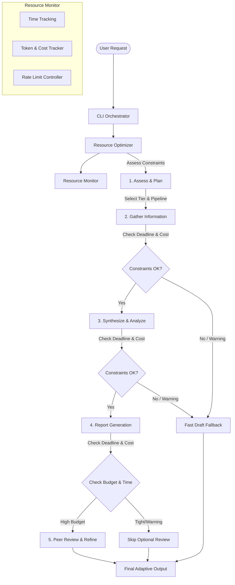

# Resource-Aware Optimization Pattern

This pattern implements **Resource-Aware Optimization** for agentic systems. In real-world enterprise deployments, calling high-capacity, expensive models or running complex, multi-stage pipelines (like extensive validation and peer reflection) for simple or low-priority queries is highly inefficient. 

This pattern acts as a **smart traffic coordinator and resources sentinel**, dynamically monitoring execution constraints (such as financial/token budgets, wall-clock time limits, and rate limits) and modifying the agent's behavior in real-time to optimize efficiency without sacrificing required quality.

---

## Key Concepts

1. **Resource Monitoring**:
   - The system tracks inputs and outputs in real-time, calculating token counts and financial costs.
   - It monitors elapsed time against strict task deadlines.
   - It intercepts API throttle statuses (429 Rate Limits).

2. **Dynamic Routing (Model Tiers)**:
   - Evaluates incoming queries and maps them to standard or advanced tiers.
   - We simulate three tiers of LLMs:
     - **Llama-3-8B-Instruct (Fast / Budget)**: Cheap ($0.15/1M tokens), fast, strict token cap.
     - **Llama-3.2-3B-Instruct (Balanced)**: Moderate ($0.60/1M tokens), balanced detail.
     - **Llama-3-70B-Instruct (Reasoning / Detail)**: Expensive ($3.00/1M tokens), detailed reasoning, verbose output.
   - *Note*: All simulated tiers call the local Ollama `llama3.2` model, but modify instruction prompts (concise instructions vs detailed guidelines), token generation limits (`num_predict`), and simulated costs.

3. **Adaptive Pipeline Execution**:
   - The default workflow is: **Assess ➔ Gather Info ➔ Synthesize ➔ Report ➔ Peer Review**.
   - If resource budgets are low or time is scarce, the agent adapts by:
     - Skipping the optional **Peer Review** reflection phase.
     - Pruning information gathering (e.g., executing 1 query instead of 3 parallel queries).

4. **Deadline-Aware Early Termination (Graceful Degradation)**:
   - The system periodically checks execution time.
   - If time elapsed exceeds a threshold (e.g., 80% of deadline), it issues a warning and jumps immediately to a **Fast Draft Fallback** step—delivering the best possible output using already-collected data rather than risking a hard timeout.

5. **Prompt Trimming & Conservation Mode**:
   - If token budget usage crosses 90%, it triggers **Emergency Conservation Mode**.
   - It strips heavy guidelines, rules, and examples from the system prompt (prompt trimming) and forces a strict response format ("Output in under 30 words").

6. **Rate Limiting & Backoff Recovery**:
   - Catches simulated `429 Too Many Requests` errors.
   - Automatically executes Exponential Backoff with jitter.
   - Falls back to local cached reports if rate limits persist.

---

## Architecture Flow



---

## File Structure

- `package.json` — Declares Node.js ES Modules environment and Ollama dependency.
- `mock-registry.js` — Mock financial database, zero-token local cache, and simulated rate limiter.
- `resource-monitor.js` — Tracks time, tokens, cost, and monitors boundaries.
- `resource-optimizer.js` — Coordinates model selection, system prompt templates, rate limit backoff, and token conservation.
- `index.js` — Main CLI coordinator providing options to simulate normal vs. highly-constrained runs.

---

## Usage

1. Install dependencies:
   ```bash
   npm install
   ```

2. Run the application:
   ```bash
   npm start
   ```

3. Select an analysis query and one of the run configurations:
   - **Standard Run**: Generous budget ($1.00) & time (30s). Everything executes using standard/advanced tiers, including Peer Review.
   - **Tight Budget Run**: Low budget ($0.05). System switches to the ultra-cheap tier, prunes prompts, and skips Peer Review.
   - **Urgent Run**: Strict deadline (4s). System monitors time, issues warnings, skips remaining steps, and triggers a Fast Draft report early.
   - **Critically Constrained Run**: Very low budget ($0.03) & strict time (3s). Combines conservation mode, strict prompt trimming, and early termination.
